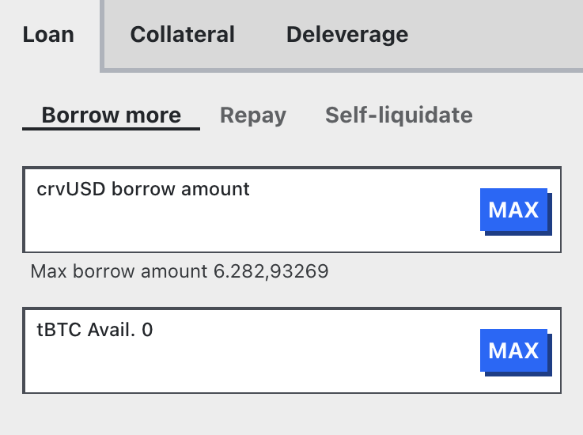
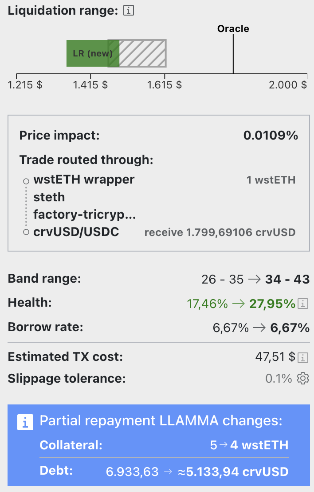

<h1> </h1>

## **Loan Creation**

In standard mode, creating a loan with crvUSD involves setting the amount of collateral asset to be added and the quantity of crvUSD desired for borrowing. Once the collateral amount is determined, the UI displays the maximum sum available for borrowing, along with the health and borrow rate.

<figure markdown>
  { width="300" }
  <figcaption></figcaption>
</figure>

The UI includes a dropdown to see additional loan parameters like the current Oracle Price and [Borrow Rate](/crvusd/understanding-tokenomics#borrow-rate).

<figure markdown>
  { width="300" }
  <figcaption></figcaption>
</figure>

n the upper right-hand side of the screen, there is a toggle for advanced mode.

<figure markdown>
  {width="500"}
  <figcaption></figcaption>
</figure>

The advanced mode adds an additional display with more information about the current distribution across all the [bands](/crvusd/understanding-tokenomics#bands) within the entire [LLAMMA](/crvusd/understanding-tokenomics#llamma). 

<figure markdown>
{ width="500" }
<figcaption></figcaption>
</figure>

It also enhances the loan creation interface by displaying the liquidation and band range, number of bands, borrow rate, and Loan to Value ratio (LTV). Additionally, users can manually select the number of bands for the loan by pressing the "adjust" button and using the slider to increase or decrease the number of bands.

<figure markdown>
  { width="300" }
  <figcaption></figcaption>
</figure>

## **Loan Management**

Everything needed to manage a loan is available in this interface. The features include:

<figure markdown>
  { width="300" }
  <figcaption></figcaption>
</figure>

**`Loan`**   
This tab provides options to `Borrow more` crvUSD, `Repay` debt, or `Self-Liquidate` a loan

**`Collateral`**  
Options to `add` or `remove` collateral from a loan are available here.

**`Deleverage`**   
This tab facilitates loan deleveraging. Find more details [here](#deleveraging-loans).

!!!info
    During soft-liquidation, users are unable to add or withdraw collateral. They can choose to either partially or fully repay their crvUSD debt to improve their health ratio or decide to self-liquidate their loan if their collateral composition contains sufficient crvUSD to cover the outstanding debt. If they opt for self-liquidation, the user's debt is fully repaid and the loan will be closed. Any residual amounts are then returned to the user.

## **Leveraging Loans**
The UI offers a leveraging feature for loans, accessible by navigating to the 'Leverage' tab.

More infomation on how to deleverage a loan [here](#deleveraging-loans).

!!!info
  Collateral can be leveraged up to 9x. This process effectively involves repeat trading of crvUSD for collateral and depositing it to maximize the collateral position. Essentially, all borrowed crvUSD is utilized to acquire more collateral.  
  **Caution is advised, as a dip in the collateral price would necessitate repaying the entire amount to reclaim the initial position.**

[Here](https://curve.substack.com/p/august-15-2023-all-or-nothing) is a good explainer on how leveraging works. 

<figure markdown>
{ width="400" }
<figcaption></figcaption>
</figure>

Toggling the advanced mode expands the display to show additional information about the loan, including the price impact, trade route and the actual leverage.

<figure markdown>
{ width="300" }
<figcaption></figcaption>
</figure>

## **Deleveraging Loans**
Deleveraging a loan — irrespective of it being [leveraged](../crvusd/loan-creation.md#leveraging-loans)  — is an option available through the UI. Users must navigate to the 'Deleverage' tab and input the amount of collateral they intend to allocate for deleveraging. This particular collateral is then converted into crvUSD, which is used to facilitate debt repayment.

<figure markdown>
  { width="300" }
  <figcaption></figcaption>
</figure>

!!!info
    When a user's loan is in soft liquidation, deleveraging is only possible if the loan is fully repaid. Apart from that, the loan can typically be self-liquidated. If the position is not in soft liquidation, the user can deliberately deleverage by any chosen amount.

The UI will provide the user with their updated loan details, such as liquidation and band range, borrow rate, and health, as well as the LLAMMA changes of collateral and debt.

<figure markdown>
{ width="300" }
  <figcaption></figcaption>
</figure>