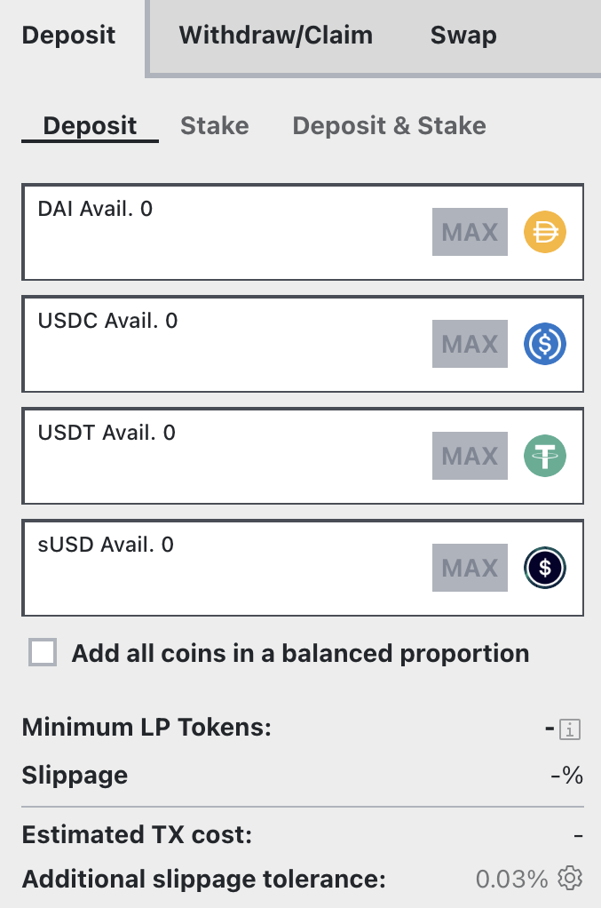

If you’re wanting to figure out Curve, please **read the starter guide**. After reading this, you should have an understanding of how Curve works, how it makes money for liquidity providers and its risks which is ideally what you want before providing liquidity.

[Understanding Curve v1](/base-features/understanding-curve)

Curve Finance sUSD pool has quickly become the biggest pool thanks to its SNX incentives which guarantee continuous returns to liquidity providers.

The sUSD pool was born out of a partnership between Curve and Synthetix who sought to help bring stability to their stablecoin sUSD. The pool is not a lending pool which means your main APY only comes from trading fees. The pool has sUSD, DAI, USDC and USDT. Unlike Y pool, the sUSD pool is quite cheap to deposit in making it a good choice if you want to try Curve with a small amount.

The current rewards have no expiry date but can be adjusted by a vote from Synthetix governance.

## **Depositing into the pool**

Visit the deposit page ([https://curve.fi/#/ethereum/pools/susd/deposit](https://curve.fi/#/ethereum/pools/susd/deposit)). You will need one or multiple stablecoins to deposit. The sUSD pool takes DAI, USDC, USDT and sUSD.

<figure markdown>
  { width="300" }
  <figcaption></figcaption>
</figure>

First, it's important to understand that you don't have to deposit all coins, you can deposit one or several of the coins in the pool and it won't affect your returns. Depositing the coin with the smallest share in the pool will result in a small deposit bonus.

Second, once you deposit one stable coin, **it gets split over the four different coins in the pool which means you now have exposure to all of them**. The first checkbox (Add all coins in a balanced proportion) allows you to deposit all four coins in the same proportion they currently are in the pool.

If you don't want to add all your stablecoins, just click the "Use maximum amount of coins available" checkbox and enter the number of coins you wish to deposit and click "Deposit and Stake".

## **Confirming and staking**

You will then be asked to approve the Curve Finance contract, follow by a deposit transaction which will wrap your stablecoins and deposit them into the pool. This transaction can be expensive so you ideally want to wait for gas to be fairly cheap if this will impact the size of your deposit.

After depositing in the pool, you receive liquidity provider (LP) tokens. They represent your share of ownership in the pool and you will need them to stake for CRV.

After depositing, you will be prompted with a new transaction that will deposit your LP tokens in the DAO liquidity gauge. Confirming the transaction **will let you mine CRV and SNX**.

You can claim both those tokens from the minter gauge.

**Once that's done, you're providing liquidity and staking so all that's left to do is wait for your trading fees to accrue.**

You can click the link below to learn how to boost your CRV rewards.
